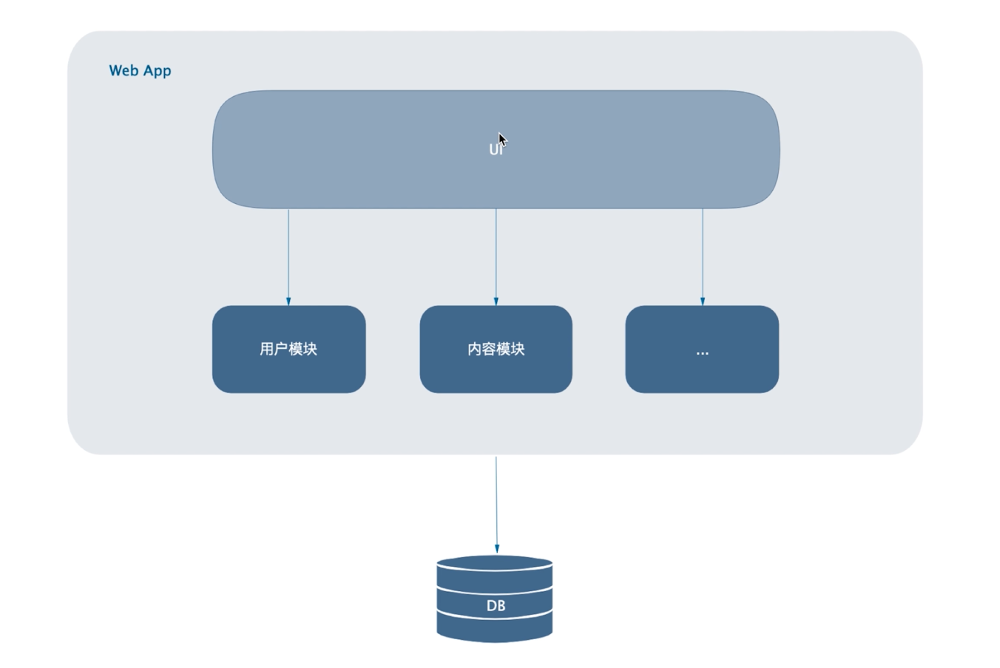
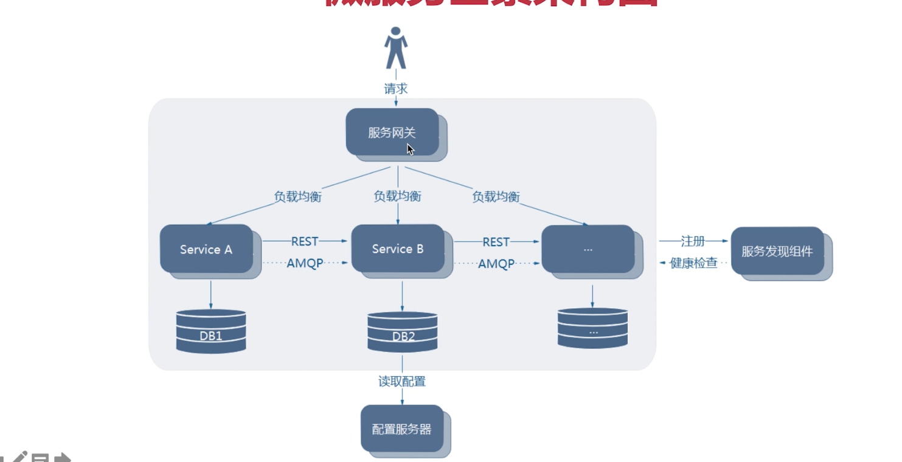

# 微服务拆分与编写
## 01.单体应用
- 
&nbsp;&nbsp;一个归档包（如war包）包含所有功能的应用程序，我们通常称之为单体应用。而架构单体应用的方法论，就是单体应用架构
### 优势 && 劣势
#### 优势
1. 架构简单
2. 开发，测试，部署均很方便

#### 劣势
1. 复杂性高
2. 部署慢，频率低(部署频率低，因为需要测试，牵一发而动全身)
3. 拓展能力受限
   - 若用户模块是CPU密集型应用，内容模块是I/O密集型应用，此时若需要对这两个模块拓展，只能再购买一台CPU性能好，内存大的服务器，不能针对于单个模块进行拓展。
4. 阻碍技术创新
   - 切换开发语言，切换框架

------------------------------------

## 02. 微服务（一种架构方法论）
&nbsp;&nbsp;微服务架构风格是一种将一个单一应用程序开发为一组小型服务的方法，每个服务运行在自己的进程中，服务间通信采用轻量级通信方式。这些服务围绕业务能力构建并且可以通过全自动部署机制独立部署。这些服务共用一个最小型的集中式管理，服务可采用不同的语言进行开发，使用不同的数据存储技术。

&nbsp;&nbsp;架构图:
- 

### 特征
1. 每个微服务可独立运行在自己的进程中
2. 一系列独立运行的微服务共同构建起整个系统
3. 每个服务为独立的业务开发，一个微服务只关注某个特定的功能，例如订单管理，用户管理等。
4. 可以使用不同的语言和数据存储技术
5. 微服务之间通过轻量的通信机制进行通信，例如通过REST API进行调用 
6. 全自动部署机制

### 优势
1. 单个服务更容易开发，维护
2. 单个微服务启动快
3. 局部修改容易部署
4. 计数栈不受限
5. 按需伸缩(CPU密集型服务放到CPU性能高的服务器上，I/O密集型Service放到内存大的服务器上)

### 缺点
1. 运维要求高
2. 分布式应用固有复杂性

## 微服务应用场景
1. 大型，复杂项目
2. 有快速迭代的需求
3. 访问压力大