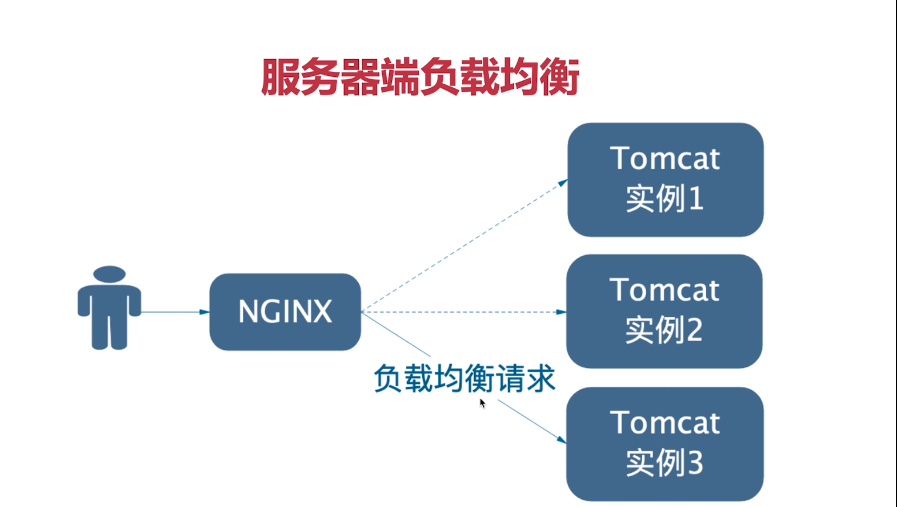
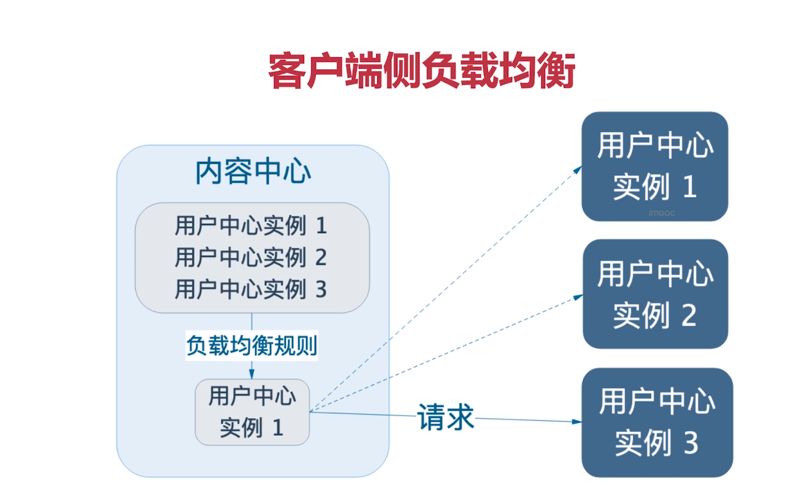
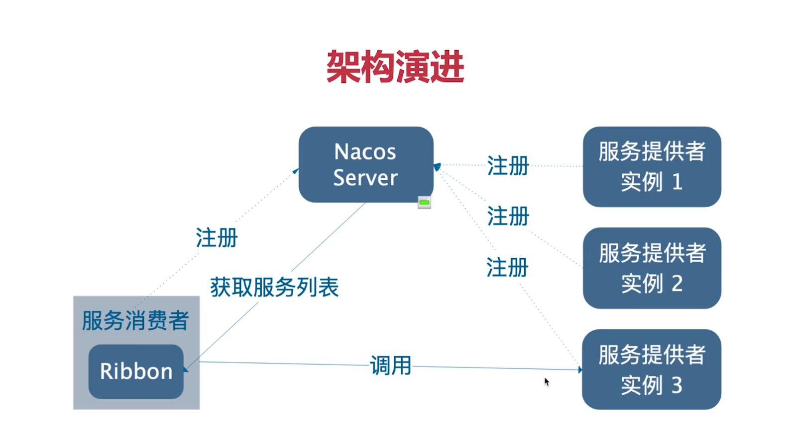

# 负载均衡
## 负载均衡实现方式
1. 服务器端负载均衡（由服务端实现）
   - 
2. 客户端负载均衡（由客户端实现，即客户端决定去请求哪一个）
   - 

## Ribbon
### 架构
- 

需要注意上下文问题(Ribbon配置类不能在Spring Boot启动类的包下，即不能被Spring Boot上下文扫描到)，否则会生成多个Spring上下文(即多个BeanFactory)

基于Nacos权重的负载均衡策略
同一集群优先调用
基于Nacos元数据的版本控制